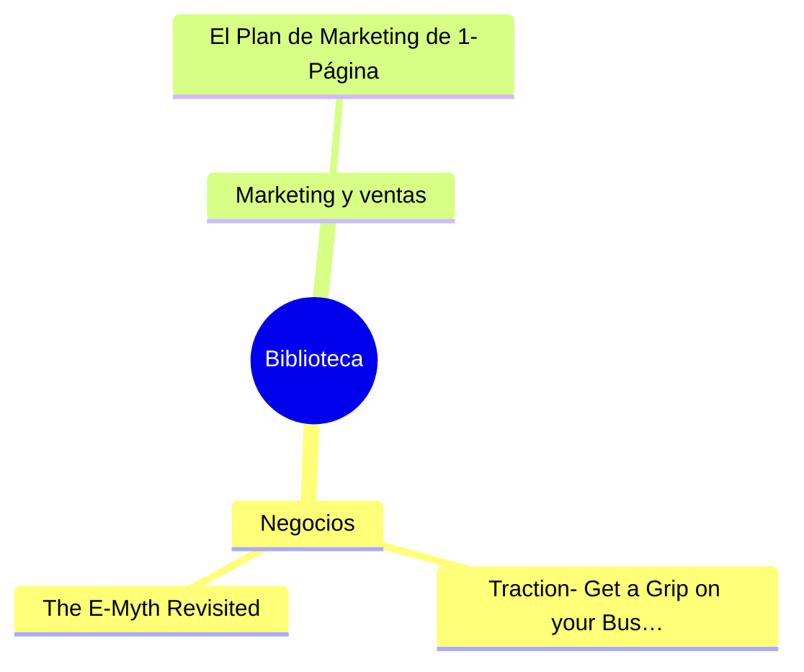

# kindle-sync

Sube automáticamente los subrayados de tu Kindle a tus notas de Obsidian.
Una nota Markdown por libro, sin duplicados, incremental.

Pensado para **macOS** y para **libros importados** (los que tú metes en el
Kindle, no comprados en Amazon).

---

## Antes de nada: qué es posible y qué no

Esto es importante porque determina si conseguirás sincronizar *mientras lees*
o solo al enchufar el cable. Depende de **cómo metiste el libro en el Kindle**:

| Origen del libro | Cómo se recogen sus subrayados | ¿Mientras lees? |
|---|---|---|
| **Comprado en Amazon** | Solo: del Cuaderno de Kindle, por Wi-Fi | **Sí**, en segundos |
| **Enviado con «Enviar a Kindle»** | Por cable, o exportando las notas por email | **No** |
| **Copiado por cable** a `documents/` | Por cable, o exportando las notas por email | **No** |

**Amazon no publica en la web las anotaciones de los documentos personales.**
Comprobado contra una cuenta real: el Cuaderno de Kindle solo lista los libros
comprados, aunque Whispersync esté activado y aunque el archivado de documentos
personales lo esté también. Da igual cómo hayas metido el libro — por email o
por cable —: si no lo compraste en Amazon, sus subrayados no salen del
dispositivo por su cuenta.

Antes de dar esto por bueno se comprobaron todas las vías, una por una:

| Vía | Resultado |
|---|---|
| Cuaderno (`/notebook`) | Solo libros comprados. No hay filtro que lo cambie: `#books-filter` es una cabecera, no un desplegable |
| Lector Web (`read.amazon.com`) | Biblioteca vacía incluso tras registrar el navegador como dispositivo, y también para los libros comprados |
| API del lector (`/kindle-library/search`) | Responde, pero `itemsList` viene vacía. Los tipos `DOCS`, `PDOC`… devuelven 400: no existen |
| Dominios de país (`read.amazon.es`) | Redirigen a `/landing`, no atienden la API |

Para esos libros quedan dos caminos, y no hay un tercero. Por **cable** no hay
truco posible: mientras el Kindle está montado en el Mac no puedes leer, y
mientras lees el Mac no ve su memoria. Por **email** sí es Wi-Fi puro, a cambio
de dos toques en el Kindle: dentro del libro, *Notas → Exportar*.

`kindle-sync` lee de las **dos** fuentes y las fusiona: si un subrayado llega
por los dos caminos, se guarda una sola vez. En la práctica: los libros
comprados llegan solos mientras lees, y los tuyos se recogen enteros cada vez
que enchufas el Kindle.

---

## Instalación

Requiere Python 3.11 o superior. El instalador se encarga del resto: entorno
virtual, dependencias, navegador, busca tu vault de Obsidian, te lleva por el
login de Amazon y deja la sincronización automática puesta.

```bash
git clone https://github.com/Jaime-data/Kindle-subrayado.git && cd Kindle-subrayado
bash instalar.sh
```

Busca los vaults por tu carpeta personal, incluidos los que viven en Google
Drive o iCloud (`~/Library/CloudStorage`, `~/Library/Mobile Documents`). Si
prefieres darle la ruta directamente:

```bash
bash instalar.sh --vault "/Users/tu-usuario/ruta/a/tus/notas"
```

Se puede volver a ejecutar cuando quieras: no repite lo que ya esté hecho.

Si el vault está en Google Drive o iCloud, ten en cuenta que las notas se
sincronizan solas entre tus equipos — pero no ejecutes `kindle-sync` en dos
ordenadores a la vez sobre la misma carpeta, o la nube creará ficheros en
conflicto.

<details>
<summary>Instalación manual, paso a paso</summary>

```bash
python3 -m venv .venv && source .venv/bin/activate
pip install -e ".[nube]"
python -m playwright install chromium
kindle-sync init          # crea ~/.config/kindle-sync/config.toml
```

Edita ese fichero y pon la ruta de tu vault:

```toml
[obsidian]
vault = "~/Documentos/MiVault"
subcarpeta = "Kindle"
```

Inicia sesión en Amazon una sola vez (se abre un navegador; haz login con tu
contraseña y tu 2FA, la sesión queda guardada):

```bash
kindle-sync login
```

Primera sincronización a mano, para comprobar que todo va:

```bash
kindle-sync sync
kindle-sync status
```

Y ya en automático, para que arranque solo al encender el Mac:

```bash
kindle-sync install-agent
```

</details>

A partir de aquí no tienes que hacer nada: subrayas leyendo, y en unos minutos
aparece en Obsidian.

## Recoger las notas por email (sin cable)

El Kindle sabe enviarse a sí mismo sus notas: dentro de un libro,
**Notas → Exportar**. Llega un correo con un adjunto que contiene todos los
subrayados de ese libro, documentos personales incluidos. `kindle-sync` puede
vaciar ese buzón solo.

Activa la fuente con tu dirección y guarda la contraseña:

```bash
kindle-sync correo --activar tu-cuenta@gmail.com
kindle-sync correo --configurar --probar
```

`--activar` edita la configuración por ti, tocando solo las claves de la
sección `[correo]` y respetando comentarios y el resto del fichero.

La contraseña **no se escribe en ningún fichero**: va al Llavero de macOS. Con
Gmail o Google Workspace necesitas una [contraseña de
aplicación](https://myaccount.google.com/apppasswords), no la tuya habitual.

El buzón se abre en modo solo lectura: no se marca, mueve ni borra nada.

## Cómo probarlo con tu Kindle

Cinco pasos, de menos a más comprometido. No pases al siguiente hasta que el
anterior te dé lo que esperas.

**1. Ver qué encuentra en tu cuenta** (no escribe nada, solo lee):

```bash
kindle-sync libros
```

Debería salir algo así:

```
Sapiens                          tienda      34 subrayado(s)
Informe interno 2025             personal    12 subrayado(s)

2 libro(s), 1 importado(s) por ti, 46 subrayado(s) en total.
```

Lo que tienes que comprobar: **que tus libros importados aparecen marcados como
`personal` y con subrayados**. Si aparecen con 0, o no aparecen, ve al final de
esta sección.

**2. Ensayo en seco**, para ver cuántas notas se crearían:

```bash
kindle-sync sync --dry-run
```

**3. Sincronización de verdad** y a mirar el resultado en Obsidian:

```bash
kindle-sync sync
kindle-sync status
```

**4. La prueba que de verdad importa: el ciclo en vivo.**

1. Coge el Kindle, abre uno de tus libros importados y **subraya una frase que
   reconozcas** (algo raro, para buscarlo luego sin dudas).
2. Asegúrate de que el Kindle tiene Wi-Fi. Para forzar la subida:
   *Ajustes → Sincronizar y buscar elementos*.
3. Espera un minuto y lanza:

   ```bash
   kindle-sync sync --verbose
   ```

Si tu frase aparece en la nota del libro dentro de Obsidian, el ciclo completo
funciona. Todo lo demás es automatizarlo.

**5. Dejarlo automático:**

```bash
kindle-sync install-agent
tail -f ~/.local/state/kindle-sync/kindle-sync.log
```

Subraya otra frase, sincroniza el Kindle, y en menos de 5 minutos deberías ver
la línea en el log sin haber tocado nada.

### Si el paso 1 no sale bien

El punto frágil es que Amazon cambie el HTML de su web sin avisar. Para verlo:

```bash
kindle-sync libros --dump ~/Escritorio/kindle-dump
```

Eso guarda el HTML y una captura de la página tal y como la ve el programa.
Con esos ficheros se arreglan los selectores en
`kindle_sync/sources/amazon_cloud.py`, y los ejemplos de `tests/fixtures/`
se actualizan a partir de ellos.

## Comandos

| Comando | Qué hace |
|---|---|
| `kindle-sync init` | Crea la configuración inicial |
| `kindle-sync login` | Guarda la sesión de Amazon (una vez cada varios meses) |
| `kindle-sync sync` | Sincroniza una vez y termina |
| `kindle-sync sync --dry-run` | Enseña qué haría, sin escribir |
| `kindle-sync sync --source clippings` | Solo desde el cable USB |
| `kindle-sync correo --activar CORREO` | Activa la fuente y escribe tu dirección en la configuración |
| `kindle-sync correo --configurar` | Guarda la contraseña del correo en el Llavero |
| `kindle-sync correo --probar` | Enseña qué exportaciones hay en el buzón |
| `kindle-sync sync --source cloud` | Solo desde la nube |
| `kindle-sync libros` | Diagnóstico: qué ve el programa en tu cuenta de Amazon |
| `kindle-sync libros --dump CARPETA` | Además guarda el HTML y capturas, para depurar |
| `kindle-sync watch` | Vigila en primer plano (útil para depurar) |
| `kindle-sync status` | Estado: destino, Kindle conectado, sesión, agente |
| `kindle-sync clasificar` | Clasifica por temática con IA, leyendo los subrayados |
| `kindle-sync modelos` | Lista los modelos que admite tu cuenta de OpenAI |
| `kindle-sync clasificar --rehacer` | Reclasifica también los que ya tienen tema |
| `kindle-sync indice` | Regenera la nota índice con el mapa mental por temas |
| `kindle-sync compactar` | Enseña cuántos subrayados duplicados hay |
| `kindle-sync compactar --aplicar` | Colapsa las versiones duplicadas de cada subrayado |
| `kindle-sync limpiar` | Enseña qué títulos tienen ruido de webs de descarga |
| `kindle-sync limpiar --aplicar` | Los renombra, fusionando duplicados y borrando notas viejas |
| `kindle-sync config --set SECCION.CLAVE=VALOR` | Cambia un ajuste sin abrir el fichero |
| `kindle-sync rebuild` | Regenera todos los `.md` desde el estado guardado |
| `kindle-sync install-agent` / `uninstall-agent` | Arranque automático con launchd |

## Cómo queda la nota en Obsidian

```markdown
---
titulo: "Sapiens"
autor: "Yuval Noah Harari"
fuente: kindle
subrayados: 34
actualizado: 2026-08-05T21:02:30
tags:
  - kindle
  - subrayados
---

# Sapiens

*Yuval Noah Harari*

> [!quote] pág. 24 · pos. 356-357 · 04/08/2025
> Los humanos evolucionaron para pensar en individuos.
^k-68cec1e1f846

<!-- kindle-sync:fin -->
```

Detalles que importan:

- El `^k-…` es un **ID de bloque de Obsidian**: puedes enlazar un subrayado
  concreto desde otra nota con `[[Sapiens - Yuval Noah Harari#^k-68cec1e1f846]]`.
- El fichero **se regenera** en cada sincronización, para mantener los
  subrayados ordenados por posición. **Todo lo que escribas por debajo de
  `<!-- kindle-sync:fin -->` se conserva intacto** — escribe ahí tus notas.
- Nada se borra nunca: el historial vive en `~/.local/state/kindle-sync/books/`.
  Si pierdes el vault, `kindle-sync rebuild` lo reconstruye entero.

## Índice por temas (mapa mental)

Cada libro se clasifica por tema —negocios, marketing, liderazgo, psicología,
inversión…— mirando el título, el autor y una muestra de sus subrayados. El
tema va al frontmatter y como etiqueta de Obsidian, y se genera una nota
`Índice.md` con un mapa mental y las secciones por tema:

````markdown

````

Obsidian dibuja ese bloque como un diagrama de verdad. Debajo van las
secciones por tema con enlaces `[[...]]` a cada libro, así que el grafo de
Obsidian también los conecta.

Además del índice, **cada temática tiene su propia nota** en `Kindle/Temas/`,
con sus libros, su mapa mental y las «ideas de fondo» — los subrayados más
desarrollados de ese tema. Así cada temática existe como nota enlazable desde
cualquier sitio de tu vault, y no solo como un apartado del índice.

```
Kindle/
├── Índice.md                    ← vista de pájaro, enlaza a cada tema
├── Temas/
│   ├── Negocios.md              ← sus libros, su mapa, sus ideas de fondo
│   ├── Marketing y ventas.md
│   └── Liderazgo y equipos.md
└── Traction - Gino Wickman.md   ← una nota por libro
```

Todo se regenera solo en cada sincronización. A mano:

```bash
kindle-sync indice
```

Si reclasificas un libro y un tema se queda sin ninguno, su nota se borra
sola — pero solo si no la has editado por debajo del marcador final.

### Que clasifique la IA

Las palabras clave aciertan lo evidente y fallan con los títulos opacos. Un
modelo que lee además una muestra de los subrayados de cada libro sabe de qué
va «The Hard Thing About Hard Things» aunque el título no lo diga:

```bash
pip install -e ".[ia]"
export OPENAI_API_KEY="sk-..."        # platform.openai.com/api-keys
kindle-sync modelos                   # qué modelos admite tu cuenta
kindle-sync config --set ia.modelo=EL-QUE-QUIERAS
kindle-sync clasificar
```

Solo toca los libros sin tema; con `--rehacer` reclasifica todos. Además de la
categoría, escribe una frase sobre de qué trata cada libro, que aparece en su
nota y en la de su tema.

Detalles: los libros van **por lotes** (una petición cada 10, no una por
libro), la respuesta se pide con un **esquema JSON estricto** para no tener que
interpretar texto libre, y las categorías nuevas que invente se reutilizan en
los lotes siguientes para que no acabe con tres nombres del mismo tema. Si la
API falla o no hay clave, cada libro se queda con lo que diga el clasificador
por palabras clave: nunca te quedas sin clasificación.

El parámetro de razonamiento solo lo admiten algunos modelos. Se manda y, si el
modelo lo rechaza, se reintenta sin él — así no hay que mantener una lista de
qué modelo es de cada tipo, que caducaría con cada lanzamiento.

Para que corra sola en cada sincronización, pon `activado = true` en `[ia]`.

### Corregir a mano

La clasificación se equivoca a veces. Se corrige en la configuración, y lo
escrito ahí manda siempre — también sobre la IA:

```toml
[categorias]
"The Hard Thing About Hard Things" = "Liderazgo y equipos"
"Storyworthy" = "Creatividad e ideas"
```

## Subrayados duplicados

Cuando extiendes un subrayado en el Kindle, el aparato **no sustituye** la
entrada anterior: escribe una nueva. Al final acabas con cuatro versiones del
mismo párrafo, cada una un poco más larga, más el fragmento suelto del final
(«rey.»). Al sincronizar se colapsan solos: sobrevive la versión más larga,
quedándose con la nota y la fecha de las que absorbe.

Para arreglar lo que ya esté escrito:

```bash
kindle-sync compactar            # enseña cuántos se eliminarían
kindle-sync compactar --aplicar  # lo hace
```

Solo se colapsa un subrayado dentro de otro **cuando las posiciones se tocan**:
la misma frase subrayada en dos capítulos distintos son dos subrayados, no una
repetición.

## Títulos limpios

Los libros descargados suelen arrastrar el nombre del fichero:
«Radical Candor (Kim Scott) (z-library.sk, 1lib.sk, z-lib.sk)». Eso se limpia
al leer, así que las notas nuevas ya salen bien. Para arreglar las que se
escribieron antes:

```bash
kindle-sync limpiar            # enseña qué cambiaría
kindle-sync limpiar --aplicar  # lo hace
```

Renombra la nota, mueve el estado, fusiona los libros que acaben con el mismo
título y borra el fichero viejo — si no, el siguiente sync crearía duplicados.

## Configuración

```toml
[obsidian]
vault = "~/Obsidian/MiVault"
subcarpeta = "Kindle"
incluir_marcadores = false          # los marcadores sin texto suelen ser ruido

[nube]
activado = true
intervalo = 300                     # segundos entre consultas a Amazon
solo_documentos_personales = false  # true = ignora los libros comprados

[usb]
activado = true
punto_montaje = "auto"              # busca el Kindle por /Volumes
intervalo = 20                      # cada cuánto mira si has enchufado el cable

[avisos]
notificaciones = true               # aviso de macOS al llegar subrayados nuevos
```

## Si algo no va

```bash
tail -f ~/.local/state/kindle-sync/kindle-sync.log
```

- **«La sesión de Amazon ha caducado»** → `kindle-sync login` otra vez.
- **La nube no devuelve tus libros importados** → es lo esperado, Amazon no los
  publica ahí. Enchufa el Kindle: por cable se recogen todos.
- **El Kindle no se detecta al enchufarlo** → con `punto_montaje = "auto"` se
  busca por `/Volumes`. Comprueba con `ls /Volumes` que aparece, y que dentro
  hay `documents/My Clippings.txt`.
- **El agente no arranca** → `launchctl list | grep kindle-sync`, y revisa el log.

## Desarrollo

```bash
pip install -e ".[dev,nube]"
python -m playwright install chromium
pytest
```

Los tests del scraper levantan un Chromium contra copias locales del HTML de
Amazon (`tests/fixtures/`), así que no dependen de la red ni de tu cuenta. Si
Chromium no está instalado, esos tests se saltan solos.
